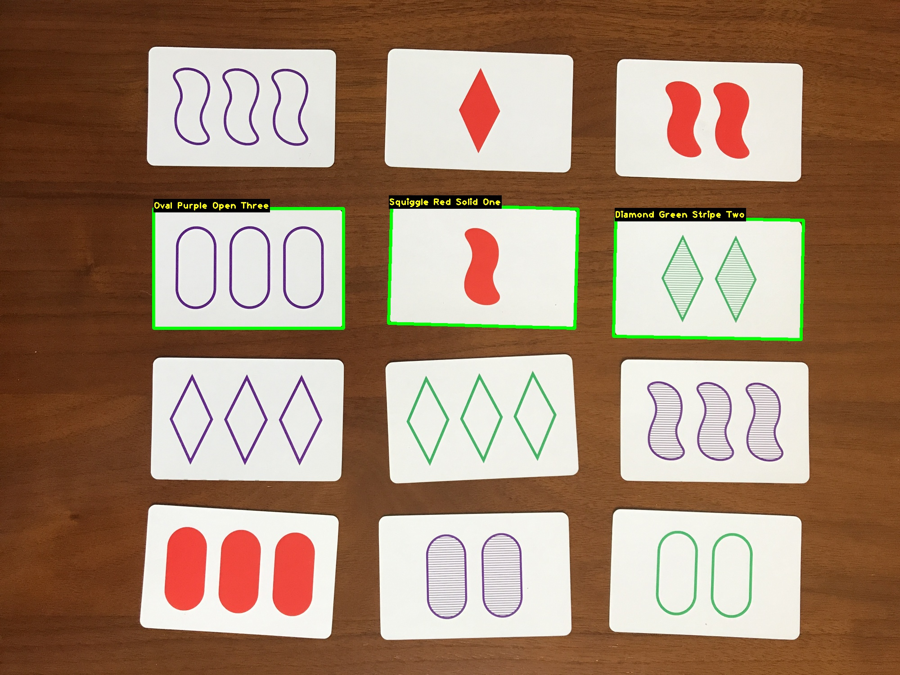

# SET-Card-Game-Solver

This is a Python program that solves the SET card game using OpenCV. The program opens an image of a game of SET (usually 12 cards), and displays the solution by drawing boxes around the three cards that make a SET.

What is SET? Set (stylized as SET or SET!) is a real-time card game designed by Marsha Falco in 1974 and published by Set Enterprises in 1991. The deck consists of 81 unique cards that vary in four features across three possibilities for each kind of feature: number of shapes (one, two, or three), shape (diamond, squiggle, oval), shading (solid, striped, or open), and color (red, green, or purple). Each possible combination of features (e.g. a card with three striped green diamonds) appears as a card precisely once in the deck. In the game, certain combinations of three cards are said to make up a "set". For each one of the four categories of features — color, number, shape, and shading — the three cards must display that feature as either a) all the same, or b) all different. Read more about the game on [Wikipedia](https://en.wikipedia.org/wiki/Set_(card_game)).



## Usage

Provide a path to an image of SET cards.

```
python set_solver_vision.py -i images/sample/IMG_5254.JPG
```

```
usage: set_solver_vision.py [-h] -i IMAGE [-a] [-s]

solve the 'sets' in the image

optional arguments:
  -h, --help                show this help message and exit
  -i IMAGE, --image IMAGE   path to input image
  -a, --annotate            skip solving and annotate all SET cards in image
  -s, --save                save a copy of the solved or annotated
                            output image to images/solved/

```

## Files

* `images/` - Image data, including sample game images, solved and annotated card images.
* `shapes/` - Images of each variation of a shape that is on a SET card. Used for matching shapes.
* `notebooks/set_card_detection.ipynb` - Jupyter notebook that shows each step of the card detection algorithm. 
* `set_solver_vision.py` - Contains the main python script to solve the SET card game from an image of SET cards.
* `set_card_detection.py` - Class and Functions for set_solver_vision.py that perform various steps of the card detection algorithm.

## Dependencies

```
Python 3.9
OpenCV 4.7.0
numpy 1.25.1
```

## Documentation

* OpenCV [documentation](https://docs.opencv.org/master/)
* opencv-python [PyPi](https://pypi.org/project/opencv-python/)

